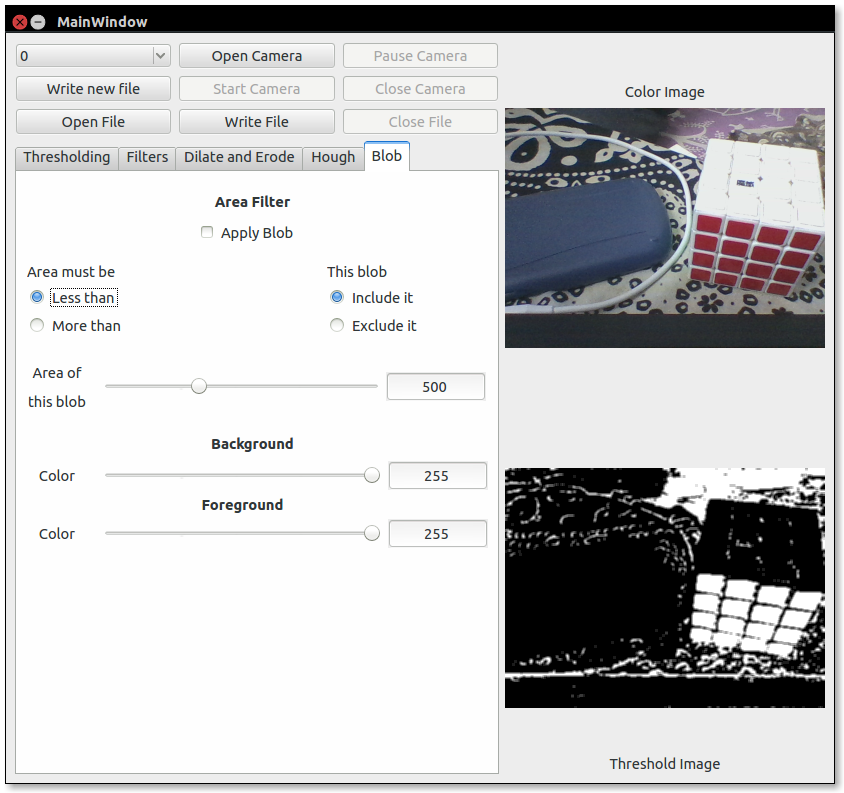

# Vision GUI

> Makes thresholding, applying filters, and seeing their output a whole lot faster!

### Capabilities

- Live camera feed shown on screen
- Open threshold values from a `*.th` file
- Directly test output on the camera that is open
- Change camera number in case you have multiple cameras attached

### Screenshots

- **The color red being thresholded from an image with other colors**

	

- **With the camera closed**

	
